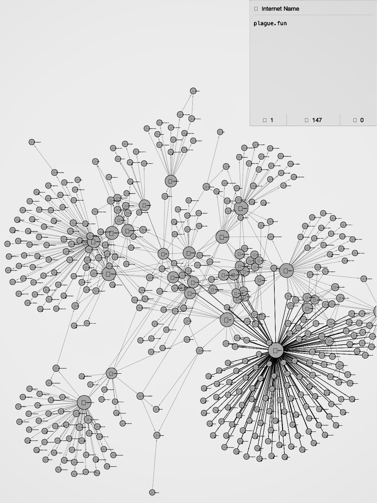

# w4sp-threat-intel
The "W4SP stealer" malware steals personal information, security credentials, and valuable files from victims. Most antivirus software does **not** detect it.

The network of criminals behind W4SP has repeatedly used it to attack the open-source supply chain, causing considerable economic damage and personally harming developers. The attacks are ongoing.

By aggregating the public data trails of known threat-actors, we have elucidated a partial, but exceptionally granular topology of the w4sp network and associated threat-space:
 

Below is a node-graph that incorporates an assumption about a given data-object that tags the object with a scalar correlating with risk of malicious activity. This allows us to tune out some noise and resolve the network with a bit more clarity (it is not a linear correlation, well it could be I have no idea, but all we did was apply a noise-gate). We think this is a good approximation of the active threat-space, it relies on the assumption that an entity considered malicious by greater than 3 sources would indicate high risk of maliciousness, and an entity not considered malicious by any would not be a high risk indicator (note that we are not actually saying that makes it low risk or assessing it at all, we are just okay with dropping it as noise in this next graph). So at this point we agreed the risk of error among points we are most concerned about is probably at its minimum but at least low enough and we could not see a way to make fewer assumptions and derive useful information so we left it there). The results seem reasonable and seem to roughly cluster around "plague.fun", "misogyny.wtf", and "zerotwo-best-waifu.online". We think those three nodes are without question malicious and that establishes at least a solid floor for looking at the rest of the network.:

Having produced a small nugget of useful information, while at the same being aware that we're in over our heads and probably drifting toward Dunning-Kruger territory, we left it there.  But we are making the data available in its entirety. 

This repository contains over 3,000 open-source data points tied to individuals suspected of culpability for the recent w4sp attacks. 

Including:
- domains
- IP addresses
- open ports
- email addresses
- public keys
- ssl certs
- server software 
- web technologies
- social media profiles
- passive dns 
- http headers
- co-hosted sites
- subdomains 
- linked content 
- spidered addresses
- raw RIR data
- exposed databases
- exposed remote desktops
- and more 

We invite you to fork this repo and add to the list. We have only scratched the surface.

Multiple formats: [HTML](./W4SP-spf.cleaned.html), [PDF](W4SP-spf.cleaned.pdf), [TXT](./w4sp.txt) ([raw](https://raw.githubusercontent.com/reconSuave/w4sp-threat-intel/main/w4sp.txt)), [GEXF](./W4SP-spf.gexf), [CSV](./W4SP-spf.csv), [JSON](./W4SP-spf.json), [XLSX](./W4SP-spf.cleaned.txt).

This is a raw intelligence report. It may contain errors or omissions, and its accuracy has not been independently verified. Please exercise prudence in your use of this information.  

  
